# CRM Frontend

A modern, full-featured CRM dashboard built with Next.js 16, React 19, and TypeScript. Role-based access, AI-powered insights, real-time notifications, dark mode, and a fully responsive UI built on shadcn/ui + Tailwind CSS v4.

---

## Screenshots

> Replace the paths below with your actual screenshots once the app is running.

### Login & Auth

| Login Page | Forgot Password | Reset Password |
|:---:|:---:|:---:|
| 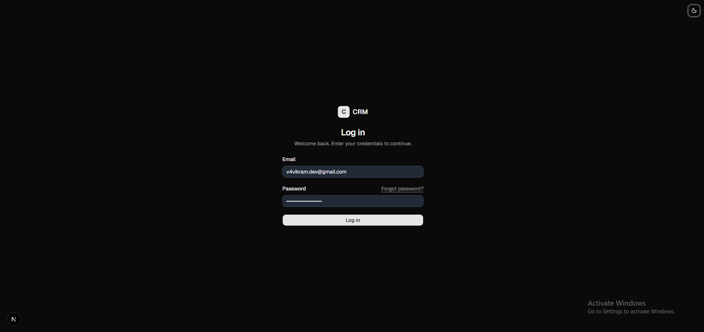 | 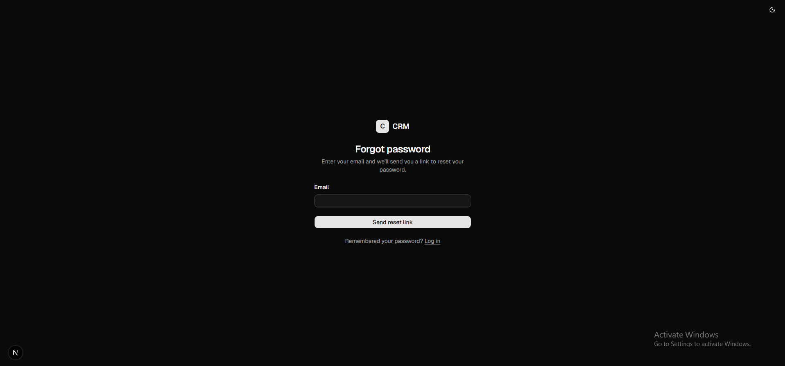 | 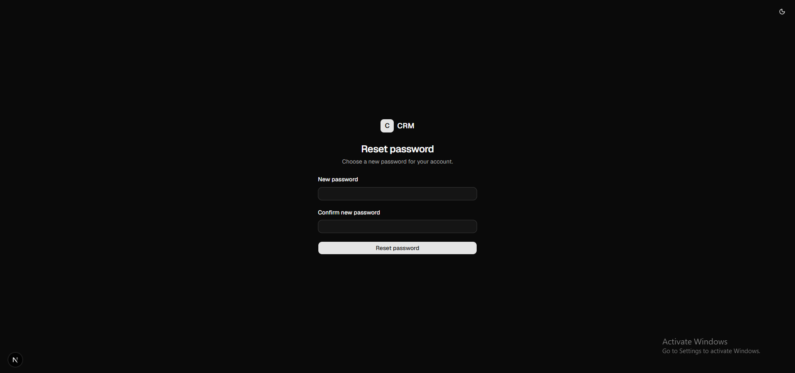 |

### Dashboard

| Overview (Admin) | Overview (Member) |
|:---:|:---:|
| 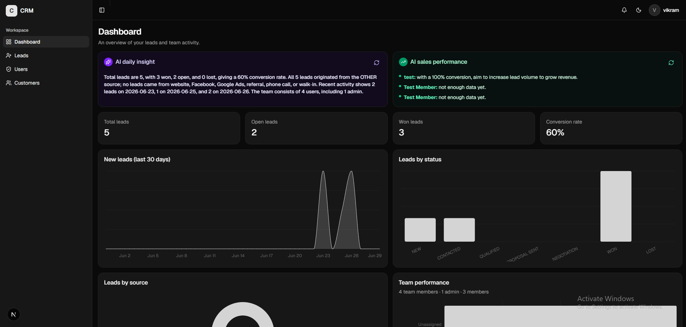 | 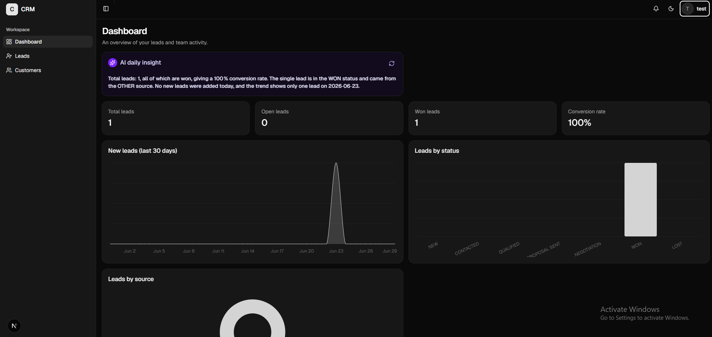 |

### Leads & Customers

| Lead List | Create Lead | Convert to Customer |
|:---:|:---:|:---:|
| 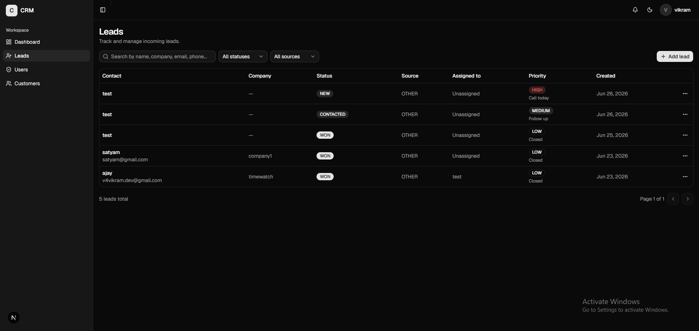 | 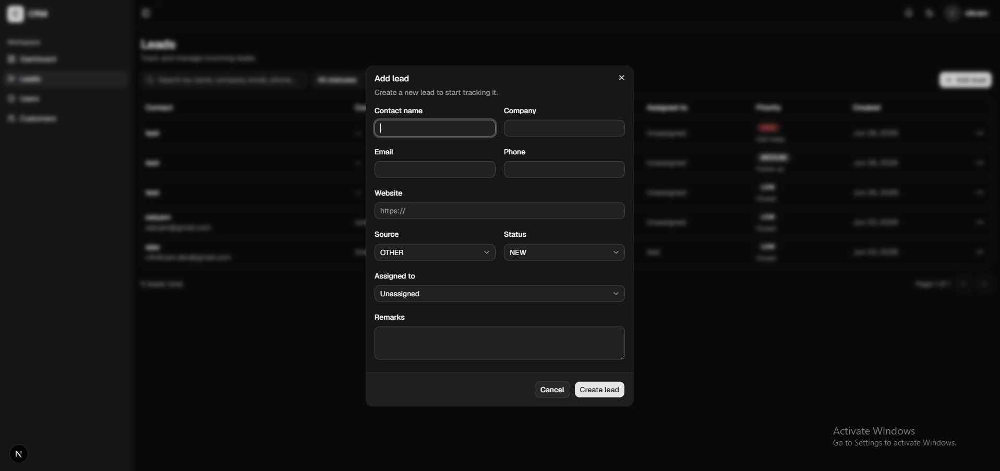 |

| Customer List | Edit Customer |
|:---:|:---:|
| 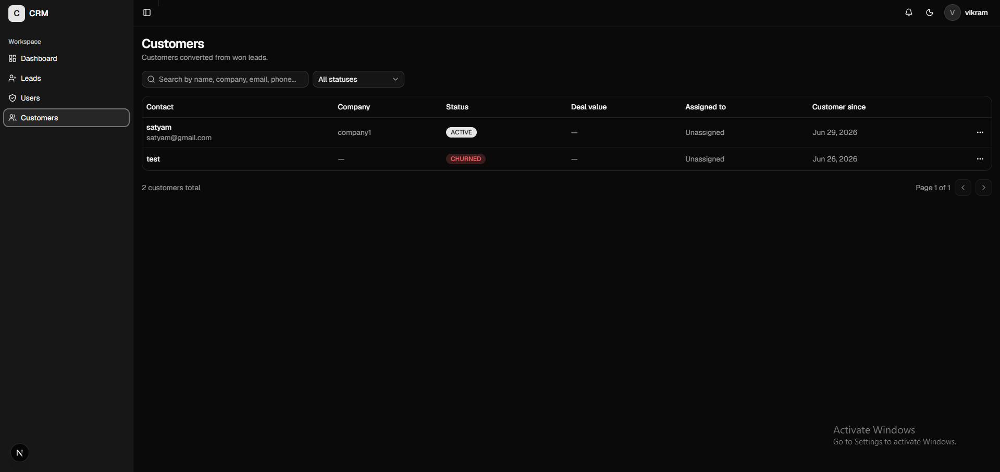 | 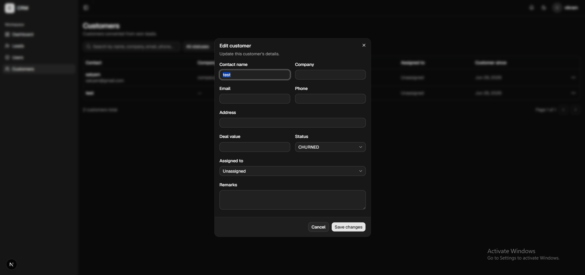 |

<!-- ### Analytics & AI

| Analytics Charts | AI Insights | Sales Performance (Admin) |
|:---:|:---:|:---:|
|  |  |  | -->

### Users & Profile

| User Management (Admin) | Profile Settings | Notifications |
|:---:|:---:|:---:|
| 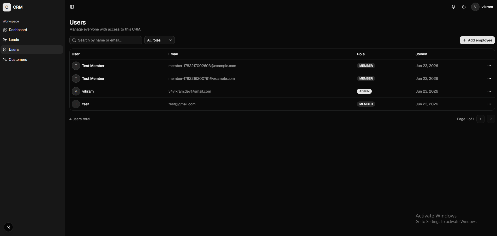 | 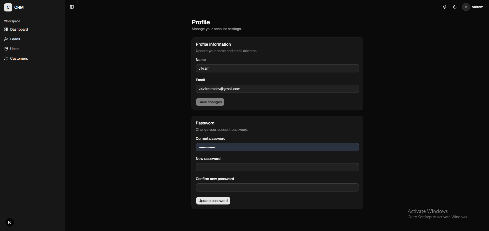 | 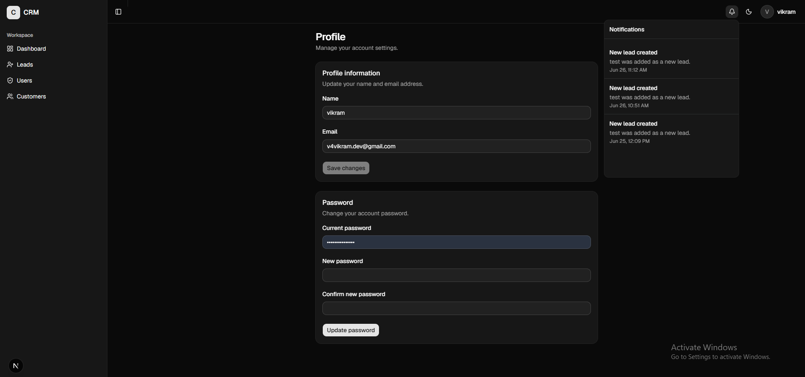 |

### Theme

| Light Mode | Dark Mode |
|:---:|:---:|
| 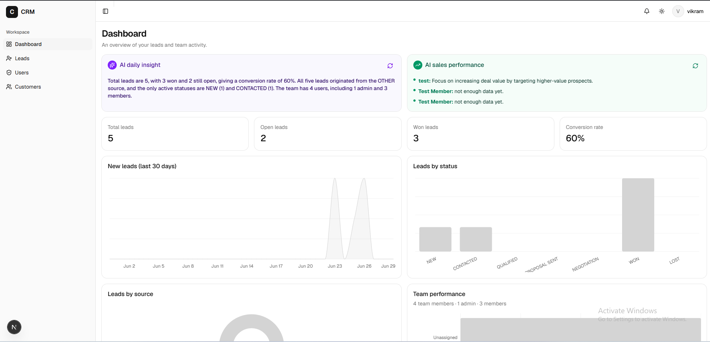 | 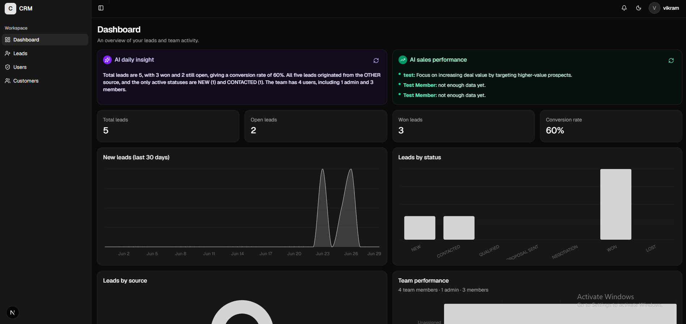 |

---

## Tech Stack

| Category | Technology |
|---|---|
| Framework | Next.js 16 (App Router) |
| UI Library | React 19 |
| Language | TypeScript 5 |
| Styling | Tailwind CSS v4 |
| Components | shadcn/ui (57 components, built on Radix UI) |
| Icons | Lucide React |
| Charts | Recharts 3 |
| Server State | TanStack React Query v5 |
| Client State | Zustand v5 |
| Forms | React Hook Form v7 + Zod v4 |
| Theme | next-themes (dark / light / system) |
| Toasts | Sonner |
| HTTP Client | Native fetch (custom wrapper) |

---

## Features

### For All Users
- **Lead Pipeline** — Create, view, update, and track leads through 7 stages (New → Won/Lost)
- **Customer Management** — Convert won leads to customers; track deal value, status, and contact info
- **Analytics Dashboard** — KPI cards, 30-day trend chart, status & source breakdowns
- **AI Daily Insight** — Groq-powered natural language summary of your lead pipeline
- **Notification Feed** — In-app notification bell with unread badge and mark-as-read
- **Profile Settings** — Update name, email, and change password
- **Dark Mode** — Toggle light / dark / system theme, persisted to localStorage
- **Responsive UI** — Works on mobile; sidebar collapses to icon-only mode

### For Admins
- **User Management** — Create, edit, delete team members; assign roles (ADMIN / MEMBER)
- **Team Analytics** — Per-rep lead counts, conversion rates, deal values (bar chart)
- **Sales Performance AI** — Groq-powered per-salesperson coaching analysis
- **Full Lead Access** — View and manage all leads across the team
- **Delete Permissions** — Soft-delete leads, customers, and users

---

## Project Structure

```
src/
├── app/                          # Next.js App Router
│   ├── (auth)/                   # Guest-only route group
│   │   ├── login/page.tsx
│   │   ├── forgot-password/page.tsx
│   │   ├── reset-password/page.tsx
│   │   └── layout.tsx            # Auth layout (centered card + theme toggle)
│   ├── dashboard/                # Protected route group
│   │   ├── page.tsx             # Dashboard overview
│   │   ├── leads/page.tsx
│   │   ├── customers/page.tsx
│   │   ├── users/page.tsx       # Admin only
│   │   ├── profile/page.tsx
│   │   └── layout.tsx           # Sidebar + topbar shell
│   ├── globals.css              # Tailwind base + CSS variables
│   ├── layout.tsx               # Root layout
│   └── providers.tsx            # React Query, Auth, Theme providers
│
├── components/
│   ├── layout/
│   │   ├── app-sidebar.tsx      # Collapsible navigation sidebar
│   │   ├── topbar.tsx           # Header: logo, notifications, theme, user menu
│   │   └── theme-toggle.tsx
│   └── ui/                      # 57 shadcn/ui components
│       ├── button, card, input, table, dialog, select, tabs ...
│       ├── chart.tsx            # Recharts wrapper with Tailwind theming
│       └── sonner.tsx           # Toast notifications
│
├── features/                    # Feature-based business logic
│   ├── auth/
│   │   ├── auth.store.ts        # Zustand: user, token, status
│   │   ├── auth-provider.tsx    # Bootstrap session on app load
│   │   ├── route-guard.tsx      # Protected / guest-only route wrapper
│   │   ├── auth.service.ts      # API calls (login, logout, refresh, me)
│   │   ├── use-auth.ts          # useLogin, useLogout, useForgotPassword hooks
│   │   ├── login-form.tsx
│   │   ├── forgot-password-form.tsx
│   │   └── reset-password-form.tsx
│   ├── leads/
│   │   ├── lead-list.tsx        # Full CRUD UI (table + filters + pagination)
│   │   ├── leads-table.tsx
│   │   ├── lead-form.tsx        # Create/edit dialog
│   │   ├── leads-filters.tsx    # Search, status, source filters
│   │   ├── use-leads.ts         # React Query list hook
│   │   └── use-lead-mutations.ts # Create/update/delete mutations
│   ├── customers/               # Same pattern as leads
│   ├── users/                   # Same pattern — ADMIN only
│   ├── profile/
│   │   ├── profile-info-form.tsx
│   │   └── change-password-form.tsx
│   ├── analytics/
│   │   ├── analytics-overview.tsx # Orchestrates all chart components
│   │   ├── summary-cards.tsx    # 4 KPI cards
│   │   ├── leads-trend-chart.tsx  # 30-day area chart
│   │   ├── leads-status-chart.tsx # Pie chart
│   │   ├── leads-source-chart.tsx # Bar chart
│   │   └── team-performance-chart.tsx # Admin only
│   ├── ai/
│   │   ├── ai-insights.tsx
│   │   ├── dashboard-insight-card.tsx
│   │   └── sales-performance-card.tsx # Admin only
│   └── notifications/
│       └── notification-bell.tsx  # Bell + popover + badge
│
├── services/
│   └── api.ts                   # Fetch wrapper (get/post/patch/delete)
│
├── hooks/
│   └── use-mobile.ts
│
├── lib/
│   └── utils.ts                 # cn() — clsx + tailwind-merge
│
└── types/
    └── api.ts                   # ApiResponse<T>, PaginatedResult<T>
```

---

## Pages & Routes

| Route | Auth | Role | Description |
|---|---|---|---|
| `/` | Any | — | Home / welcome page |
| `/login` | Guest only | — | Email + password login |
| `/forgot-password` | Guest only | — | Request password reset email |
| `/reset-password` | Guest only | — | Set new password via token |
| `/dashboard` | Protected | Any | Analytics overview + AI insights |
| `/dashboard/leads` | Protected | Any | Lead pipeline management |
| `/dashboard/customers` | Protected | Any | Customer management |
| `/dashboard/users` | Protected | ADMIN | User/employee management |
| `/dashboard/profile` | Protected | Any | Profile settings + password change |

> **Guest only** routes redirect to `/dashboard` if already logged in.
> **Protected** routes redirect to `/login` if not authenticated.

---

## Prerequisites

- Node.js >= 20
- The [CRM Backend](../crm-backend/README.md) running on `http://localhost:5000`

---

## Getting Started

```bash
# 1. Install dependencies
npm install

# 2. Set environment variables
cp .env.example .env.local
# Set NEXT_PUBLIC_API_URL (see Environment Variables below)

# 3. Start development server
npm run dev
```

Open [http://localhost:3000](http://localhost:3000) in your browser.

---

## Scripts

| Script | Description |
|---|---|
| `npm run dev` | Start development server with hot reload |
| `npm run build` | Build for production |
| `npm start` | Run the production build |
| `npm run lint` | Run ESLint |

---

## Environment Variables

```env
# .env.local — development
NEXT_PUBLIC_API_URL=http://localhost:5000/api/v1

# .env.production.local — production
NEXT_PUBLIC_API_URL=https://your-backend.onrender.com/api/v1
```

`NEXT_PUBLIC_` prefix exposes the variable to the browser. Never put secrets here.

---

## Authentication Flow

```
App Load
  │
  ├── AuthProvider mounts
  │     │
  │     ├── POST /auth/refresh  (uses refreshToken cookie)
  │     │     ├─ success → GET /auth/me → setSession(user, token)
  │     │     └─ fail    → clearSession() → user is "guest"
  │     │
  │     └── status: "loading" → "authenticated" | "guest"
  │
  ├── RouteGuard checks status
  │     ├─ "authenticated" + protected route  → render page
  │     ├─ "guest"         + protected route  → redirect /login
  │     └─ "authenticated" + guest-only route → redirect /dashboard
  │
  └── Every API call attaches: Authorization: Bearer {accessToken}
```

**Token storage:**
- `accessToken` — in-memory only (Zustand store, never localStorage)
- `refreshToken` — HTTPOnly cookie managed by the backend (invisible to JS)

---

## State Management

| State | Tool | What it holds |
|---|---|---|
| Auth | Zustand | `user`, `accessToken`, `status` (loading / authenticated / guest) |
| Server data | React Query | Leads, customers, users, analytics — cached, 60s stale time |
| Forms | React Hook Form | Field values, validation errors, submit state |
| Theme | next-themes | light / dark / system preference |

**React Query config:**
- `staleTime` 60s — data stays fresh for 1 minute before background refetch
- `retry` 1 — failed requests retried once
- `placeholderData: keepPreviousData` — tables show previous page while fetching next

---

## Role-Based UI

| Feature | ADMIN | MEMBER |
|---|---|---|
| View all leads | ✅ | Own only |
| Create leads | ✅ | ❌ |
| Delete leads / customers | ✅ | ❌ |
| Convert lead → customer | ✅ | ✅ |
| Users page | ✅ | Hidden |
| Team analytics chart | ✅ | Hidden |
| AI sales performance card | ✅ | Hidden |
| Update own profile | ✅ | ✅ |
| Change own password | ✅ | ✅ |

Role is read from the Zustand auth store. The sidebar automatically hides the **Users** link for MEMBER role.

---

## Analytics & Charts

All charts use **Recharts** wrapped in the shadcn `<Chart>` component with Tailwind CSS variable colors — works seamlessly in both light and dark mode.

| Chart | Type | Scope |
|---|---|---|
| 30-day lead trend | Area chart | Scoped to user (admin = all) |
| Lead status distribution | Pie chart | Scoped to user |
| Lead source breakdown | Bar chart | Scoped to user |
| Team performance | Bar chart | Admin only |

KPI summary cards: **Total Leads**, **Open Leads**, **Won Leads**, **Conversion Rate %**

---

## API Integration

All HTTP calls go through `src/services/api.ts` — a thin fetch wrapper:

```ts
apiClient.get('/leads?page=1&limit=20', { token })
apiClient.post('/leads', body, { token })
apiClient.patch('/leads/:id', body, { token })
apiClient.delete('/leads/:id', { token })
```

Each feature has its own service + React Query hooks. Mutations automatically invalidate the relevant query cache on success so the UI always reflects the latest data.

---

## Component Architecture

Every feature follows the same pattern:

```
feature/
├── *.service.ts          — raw API calls (no React)
├── use-*.ts              — React Query useQuery / useMutation hooks
├── *.validation.ts       — Zod schema for form fields
├── *.types.ts            — TypeScript interfaces & DTOs
└── *.tsx                 — UI components (list, table, form, dialogs)
```

Pages are thin — they just render the feature's top-level component:

```tsx
// app/dashboard/leads/page.tsx
import { LeadList } from "@/features/leads/lead-list";
export default function LeadsPage() {
  return <LeadList />;
}
```

---

## Related

- [CRM Backend README](../crm-backend/README.md) — REST API docs, environment setup, full API reference
- [Postman Collection](../crm-backend/postman/CRM_API.postman_collection.json) — Import to test all API endpoints
